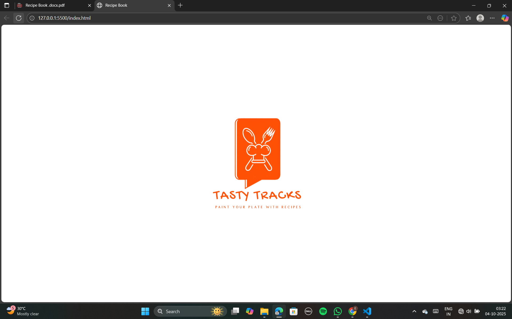
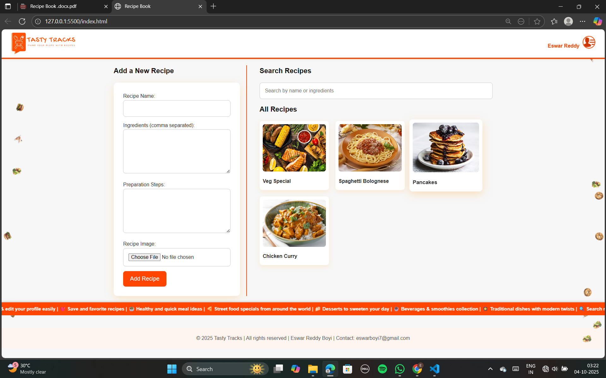

### Tasty Tracks – Paint Your Plate with Recipes

Tasty Tracks is a recipe management web app built with HTML, CSS, and JavaScript.
It allows users to create, search, and manage recipes directly in the browser using Local Storage – no server or database required.

With animations, falling food effects, scrolling info bar, and a stylish UI, this app makes recipe exploration fun and interactive.

Demo Link: https://tastytracks-f6358.web.app

-------------------

### Features

***1. Add Recipes*** – Users can add recipes with:

Recipe name

Ingredients (comma-separated)

Preparation steps

Upload an image

***2. Search Recipes*** – Search by name or ingredients in real time.

***3. Profile Management*** –

Sign up / Sign in / Google Sign-in (UI only)

Edit profile details

***4. Local Storage Integration*** – Recipes and profile data persist across refresh & reopen.

***5. Animations & UI Enhancements*** –

Falling food animation along left/right borders 🍕

Scrolling info bar with project highlights 📢

Intro animation: Big logo splash when loading 🎬

Stylish Navbar & Footer

***6. Info Bar (Ticker)*** – Displays continuous scrolling updates such as:

Recipe tips

Features of the app

Project credits

***7. No Database Required*** – Runs entirely in the browser.

------------------

### Getting Started

***1. Clone the Repository***
```
git clone https://github.com/EswarReddyBoyi/tasty-tracks.git
cd tasty-tracks
```

***2. Open the App***

Simply open index.html in your browser. No server required.

----------------

### Screenshots

<table>
  <tr>
    <th> Index Page</th>
    <th> Index Page</th>
  </tr>
  <tr>
    <td> </td>
    <td> </td>
  </tr>
</table>

----------------

### Technologies Used

HTML5 – Structure

CSS3 – Styling & Animations

JavaScript (Vanilla) – Logic & Local Storage

Local Storage API – Data persistence

----------

### How It Works

When the app loads, a logo splash screen animation is shown.

Users can sign up / sign in (UI only, no backend).

Add recipes with name, ingredients, steps, and image.

Recipes are saved in Local Storage.

Recipes are searchable by name or ingredients.

Falling food icons and info bar run continuously for fun UI effects.

Footer displays project credits.

---------

### Info Bar Messages

Some example scrolling info messages:

🍽️ Tasty Tracks — Paint your plate with recipes ✨

📖 Explore 1000+ recipes from all cuisines 🌍

❤️ Save and favorite recipes

🥗 Healthy and quick meal ideas

🍕 Street food specials

🍰 Desserts to sweeten your day

☕ Beverages & smoothies

🥘 Traditional dishes with modern twists

⏲️ Quick 15-min snack recipes

🎉 Festival & seasonal recipes

🚀 Built with HTML, CSS, JS & Local Storage

-----------

### Deployment

You can easily deploy this project using:

Netlify

Vercel

GitHub Pages

Example for Netlify:

Drag & drop the project folder into Netlify Deploy
.

Done.

---------

#### License

This project is licensed under the MIT License.
You are free to use, modify, and distribute this project with proper credit.

-----------

### Author

Eswar Reddy Boyi |
Email: eswarboyi7@gmail.com |
 GitHub: https://github.com/EswarReddyBoyi
